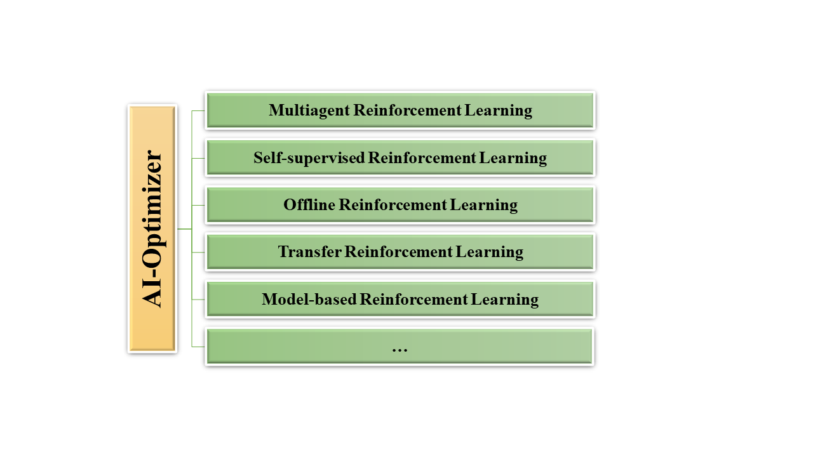
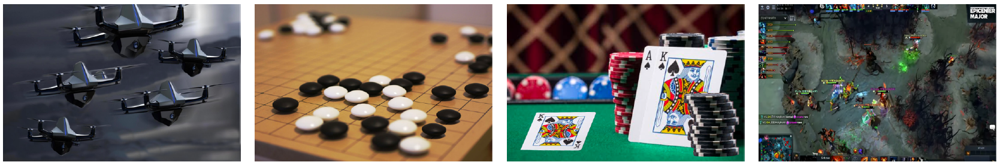
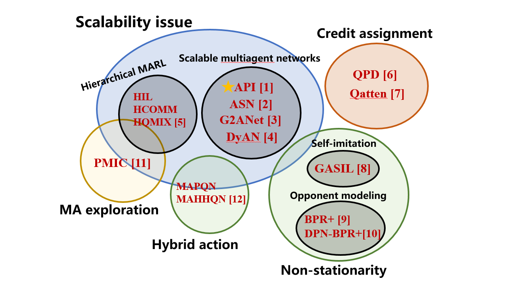

# AI-Optimizer
AI-Optimizer is a next-generation deep reinforcement learning suit, providing rich algorithm libraries ranging from model-free to model-based RL algorithms, from single-agent to multi-agent algorithms. Moreover, AI-Optimizer contains a flexible and easy-to-use distributed training framework for efficient policy training.

AI-Optimizer now provides the following built-in libraries, and more libraries and implementations are coming soon.
- [Multiagent Reinforcement learning](multiagent-rl)
- [Self-supervised Representation Reinforcement Learning](self-supervised-rl)
- [Offline Reinforcement Learning](offline-rl-algorithms)
- [Transfer and Multi-task Reinforcement Learning](https://github.com/TJU-DRL-LAB/transfer-and-multi-task-reinforcement-learning)
- [Model-based Reinforcement Learning](modelbased-rl)

## Multiagent Reinforcement Learning (MARL)
The Multiagent RL repo contains the released codes of representative research works of TJU-RL-Lab on Multiagent Reinforcement Learning (MARL). 

### ❓ Problem to Solve

Multi-agent reinforcement learning (MARL) has successfully addressed many complex real-world problems, such as playing the game of Go ([AlphaGo](https://idp.nature.com/authorize/casa?redirect_uri=https://www.nature.com/articles/nature16961%257D&casa_token=JKjRDdaog1cAAAAA:cwpvaRtkWOQi-K-NGT2AT9bNM1kcA5NgXWU7MVIdrI6poJ8FwDxyunnDEpGaOuoUxfA4RzOumao3MqS-8mU), [AlphaGo Zero](https://www.nature.com/articles/nature24270?sf123103138=1)), playing real-time multi-player strategy games ([StarCraft II](https://www.nature.com/articles/s41586-019-1724-z?), [Dota 2](https://arxiv.org/abs/1912.06680), [Honor of Kings](https://arxiv.org/abs/2011.12895))，playing card games ([Poker](https://www.science.org/doi/abs/10.1126/science.aay2400?casa_token=YpsKCNt7LNwAAAAA:POhK0ufRyfzaHXWiywSHPk6nvzugQVsTNYdSZyteYTkRRPA4zccUvmnOBYC2DBFcIytHN9FPqZ-s6SUY), [no-limit Poker](https://www.onlinecasinoground.nl/wp-content/uploads/2018/10/Libratus-super-human-no-limit-poker-Sandholm-Brown.pdf)), [robotic control](https://arxiv.org/abs/1709.06011) and autonomous driving ([Smarts](https://arxiv.org/abs/2010.09776)). However, MARL suffers from several challenges in theoretical analysis, in addition to those that arise in single-agent RL. We summarize below the challenges that we regard as fundamental in developing theories for MARL.

- **The curse of dimensionality (scalability) issue**
- **Non-stationarity**
- **Non-Unique Learning Goals**
- **Exploration–exploitation tradeoff**
- **Multiagent credit assignment problem**
- **Partial observability**
- **Hybrid action**

Our target is to design MARL algorithms which could solve or alleviate the problems mentioned above and promote the deployment and landing of MARL in more real-world applications.

### ⭐️ Core Idea

We carry out our studies according to the challenges mentioned above. To solve the the curse of dimensionality issue, we design a series of scalable multiagent neural networks which could efficiently reduce the size of the search space by leveraging the [permutation invariance and permutation equivariance properties](https://arxiv.org/abs/2203.05285), explicitly taking the [action semantics](https://arxiv.org/abs/1907.11461) into consideration, etc. To better make a balance of the exploration–exploitation tradeoff, we propose Progressive Mutual Information Collaboration to achieve more efficient cooperative  exploration... An overall picture of the proposed methods is shown below.

### 💦 Contribution

The main contribution of this repository is that we release a serials of efficient, scalable, well-performed and easy to use MARL algorithms which achieve superior performance in the typical benchmarks of the MARL research community. Besides, we provide a systematic overview of challenges in MARL. With this repo and our research works, we want to draw the attention of MARL community to design more efficient, more scalable, well-performed and much easier to use MARL algorithms and promote the deployment and landing of MARL in more real-world applications.

## Offline-rl-algorithms (Offrl)
### ❓ Problem to Solve
Current deep RL methods still typically rely on active data collection to succeed, hindering their application in the real world especially when the data collection is dangerous or expensive.  Offline RL (also known as batch RL) is a data-driven RL paradigm concerned with learning exclusively from static datasets of previously-collected experiences. In this setting, a behavior policy interacts with the environment to collect a set of experiences, which can later be used to learn a policy without further interaction. This paradigm can be extremely valuable in settings where online interaction is impractical. However, current offline rl methods are restricted to three challenges: 
 * Low upper limit of algorithm: The quality of offline data determines the performance of offline reinforcement learning algorithms. How to expand low-quality offline data without additional interaction to increase the learning upper limit of offline reinforcement learning algorithms?
 * Poor algorithm effect: Existing off-policy/offline algorithm trains on the offline data distribution. When interacting with the environment, the distribution of the accessed state-action may change compared with the offline data (Distributional Shift). In this situation, the Q value of the <state, action> pair is easy to be overestimated, which affects the overall performance. How to characterize the data outside the offline data distribution (Out Of Distribution, OOD) to avoid overestimation?
 * Difficulty in applying the algorithm: Due to the limited quality of the dataset, the learned strategy cannot be directly deployed in the production environment, and further online learning is required. How to design data sampling in the online training phase to avoid the sudden drop in the initial performance of the strategy due to the redundant data generated by the distribution change, and quickly converge to the optimal solution in a limited number of interactions?

### 💦 Contribution
This repository contains the codes of representative benchmarks and algorithms on the topic of Offline Reinforcement Learning. The repository is developed based on d3rlpy(https://github.com/takuseno/d3rlpy) following MIT license to shed lights on the research on the above three challenges. While inheriting its advantages, the additional features include (or will be included):
 - A unified algorithm framework with more algorithms
   - REDQ
   - UWAC
   - BRED
   - …
 - More datasets:
   - Real-world industrial datasets
   - Multimodal datasets
   - Augmented datasets (and corresponding methods)
   - Datasets obtained using representation learning (and corresponding methods)
 - More log systems 
   - Wandb

## Self-supervised Reinforcement Learning (SSRL)
SSRL repo contains the released codes of representative research works of TJU-RL-Lab on Self-supervised Representation Learning for RL. 

To the best of our knowledge, this is the **first** code repository for SSRL established by following **a systematic research taxonomy** and **a unified algorithmic framework**.

### ❓ Problem to Solve
Since the RL agent always _receives_, _processes_, and _delivers_ all kinds of data in the learning process (i.e., the typical Agent-Environment Interface), 
how to **properly represent such "data"** is naturally the key point to the effectiveness and efficiency of RL.

In this branch, we focus on **three key questions** as follows:
- **What should a good representation for RL be? (Theory)** 
- **How can we obtain or realize such good representations? (Methodology)**
- **How can we making use of good representations to improve RL? (Downstream Learning Tasks & Application)**

### ⭐️ Core Idea
Taking **Self-supervised Learning** (SSL) as our major paradigm for representation learning, we carry out our studies from four perspectives: 
**State Representation**,
**Action Representation**,
**Policy Representation**,
**Environment (and Task) Representation**.

These four pespectives are major elements involved in general _Agent-Environment Interface_ of RL.
They play the roles of _input_, _optimization target_ and etc. in the process of RL.
The representation of these elements make a great impact on the sample efficiency, convergence optimality and cross-enviornment generalization.

### 💦 Contribution
The central contribution of this repo is **A Unified Algorithmic Framework (Implementation Design) of SSRL Algorithm**.
The framework provides a unified interpretation for almost all currently existing SSRL algorithms. Moreover, the framework can also serve as a paradigm when we are going to devise new methods.

Our ultimate goal is to promote the establishment of the ecology of SSRL, which is illustrated below.

Towards addressing the key problems of RL,
we study SSRL with four types of representations.
For researches from all four pespectives, a unified framework of algorithm and imeplementation serves as the underpinnings.
The representations studied from different pespectives further boost various downstream RL tasks.
Finally, this promotes the deployment and landing of RL in real-world applications.

See more [here](self-supervised-rl).

### 🌏 Intention & Impact

With this repo and our research works, we want to draw the attention of RL community to studies on Self-supervised Representation Learning for RL.

- For people who are insterested in RL, our introduction in this repo and our [blogs](https://zhuanlan.zhihu.com/p/413321572) can be a preliminary tutorial.
- For cutting-edge RL researchers, we expect that our research thoughts and proposed SSRL framework can open up some new angles for future works on more advanced RL.
- For RL participators (especially who work on related fields), we hope that our opensource works and codes may be helpful and inspiring.

We are also looking forward to feedback in any form to promote more in-depth researches.

## Transfer and Multi-task Reinforcement Learning
Recently, Deep Reinforcement Learning (DRL) has achieved a lot of success in human-level control problems, such as video games, robot control, autonomous vehicles, smart grids and so on. However, DRL is still faced with the **sample-inefficiency problem** especially when the state-action space becomes large, which makes it difficult to learn from scratch. This means the agent has to use a large number of samples to learn a good policy. Furthermore, the sample-inefficiency problem is much more severe in Multiagent Reinforcement Learning (MARL) due to the exponential increase of the state-action space.  

### ❓ Problem to Solve

**Sample-inefficiency problem**: The main challenge that transfer and multi-task RL aims to solve is the sample-inefficiency problem. This problem forces the agent to collect a huge amount of training data to learn the optimal policy. For example, the Rainbow DQN requires around 18 million frames of training data to exceed the average level of human players, which is equivalent to 60 hours of games played by human players. However, human players can usually learn an Atari game within a few minutes and can reach the average level of the same player after one hour of training. 

### ⭐️ Core Idea

- **Transfer RL** which leverages prior knowledge from previously related tasks to accelerate the learning process of RL, has become one popular research direction to significantly improve sample efficiency of DRL. 

- **Multi-task RL**, in which one network learns policies for multiple tasks, has emerged as another promising direction with fast inference and good performance.

### 💦 Contribution

This repository contains the released codes of representative benchmarks and algorithms of TJU-RL-Lab on the topic of Transfer and Multi-task Reinforcement Learning, including the single-agent domain and multi-agent domain, addressing the sample-inefficiency problem in different ways.

In this repo, we provide specific solutions of our lab including:
* **PTF** addresses the **Sample-inefficiency problem** in DRL by proposing a novel Policy Transfer Framework (PTF).

* **MAPTF** addresses the **Sample-inefficiency problem** in deep MARL by proposing a Multi-Agent Policy Transfer Framework (MAPTF).

* **KTM-DRL(reproduced)** : A Knowledge Transfer based Multi-task Deep Reinforcement Learning framework (KTM-DRL) for continuous control. We reproduce the results in the MuJoCo continuous control task suite, more details can be find [here](https://github.com/TJU-DRL-LAB/transfer-and-multi-task-reinforcement-learning/tree/main/Single-agent%20Multi-task%20RL/KTM-DRL).

See more [here](https://github.com/TJU-DRL-LAB/transfer-and-multi-task-reinforcement-learning).

## Model-based Reinforcement Learning (MBRL)
Model-based reinforcement learning (MBRL) is widely seen as having the potential to be significantly more sample efficient than model-free RL. By learning a model of the environment, model-based methods learn with significantly lower sample complexity.The model of the environment is a representation model that explicitly contains knowledge about the environment or the task, and generally two types of models are included: a transition model or a dynamics model and the reward model. Once this model is modeled, it can be properly integrated into the interaction with the environment and the learning of strategies. 

### ❓Problems to Solve

The current classifications of the mainstream algorithms in the modern Model-Based RL area are orthogonal, which means some algorithms can be grouped into different categories according to different perspectives. In this branch, we focus on two key questions  :`How to Learn a Model` and `How to Utilize a Model`.

- `How to Learn a Model` mainly focuses on how to build the environment model. 
- `How to Utilize a Model` cares about how to utilize the learned model. 

### ⭐️ Core Directions

Ignoring the differences in specific methods, the purpose of MBRL algorithms can be more finely divided into four directions as follows: `Reduce Model Error`、`Faster Planning`、` Higher Tolerance to Model Error` 、`Scalability to Harder Problems`.  For the problem of `How to Learn a Model`, we can study on reducing model error to learn a more accurate world model or learning a world model with higher tolerance to model error. For the problem of `How to Utilize a Model`, we can study on faster planning with a learned model or the scalability of the learned model to harder problems.   

### 💦 Contributions
With this repo and our research works, we want to draw the attention of RL community to studies on Model Based RL.

- For people who are insterested in model based RL, our introduction in this repo and our [ZhiHu blog series](https://zhuanlan.zhihu.com/p/425318401) can be a preliminary tutorial.
- For Researchers in model-based RL, we collect several separate lines of research, which are sometimes closed-sourced or not reproducible and make some code-level optimizations for the convinience to find comparative baselines without the need to search around for implementations.
- We expect that our research thoughts and proposed topic for MBRL area can open up some new angles for future works on more advanced RL. **What' more, We want to cover as many interesting new directions as possible, and then divide it into the topic we listed above, to give you some inspiration and ideas for your RESEARCH.**

Research in model-based RL has not been very standardized. It is fairly common for authors to experiment with self-designed environments, and there are several separate lines of research, which are sometimes closed-sourced or not reproducible. And for this, we have collected some of the mainstream MBRL algorithms and made some code-level optimizations. Bringing these algorithms together in a unified framework can save the researchers time in finding comparative baselines without the need to search around for implementations. Currently, we have implemented Dreamer, MBPO,BMPO, MuZero, PlaNet, SampledMuZero, CaDM and we plan to keep increasing this list in the future.  We will constantly update this repo to include new research made by TJU-DRL-Lab to ensure sufficient coverage and reliability. We are also looking forward to feedback in any form to promote more in-depth researches. See more [here](https://github.com/TJU-DRL-LAB/AI-Optimizer/tree/main/modelbased-rl).

# Contributing
AI-Optimizer is still under development. More algorithms and features are going to be added and we always welcome contributions to help make AI-Optimizer better. Feel free to contribute.
