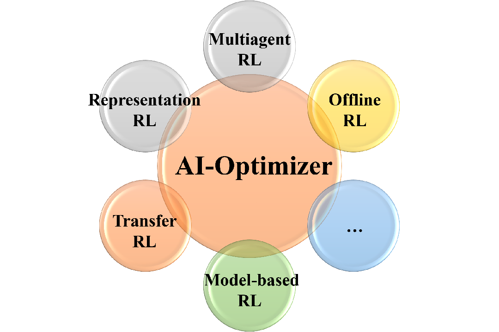

# AI-Optimizer

AI-Optimizer is a next generation of deep reinforcement learning framework, privoding rich algorithm libraries ranging from model-free to model-based RL algorithms, from single-agent to multi-agent algorithms. 

For now, AI-Optimizer privodes following facets and more libraries and implementations are comming soon.
- Model-based reinforcement learning
- Representation Learning  
- Multiagent Reinforcement learning
- Transfer Learning
- Offline Reinforcement Learning

# Contributing
AI-Optimizer is still under development. More algorithms and features are going to be added and we always welcome contributions to help make AI-Optimizer better. Feel free to contribute.