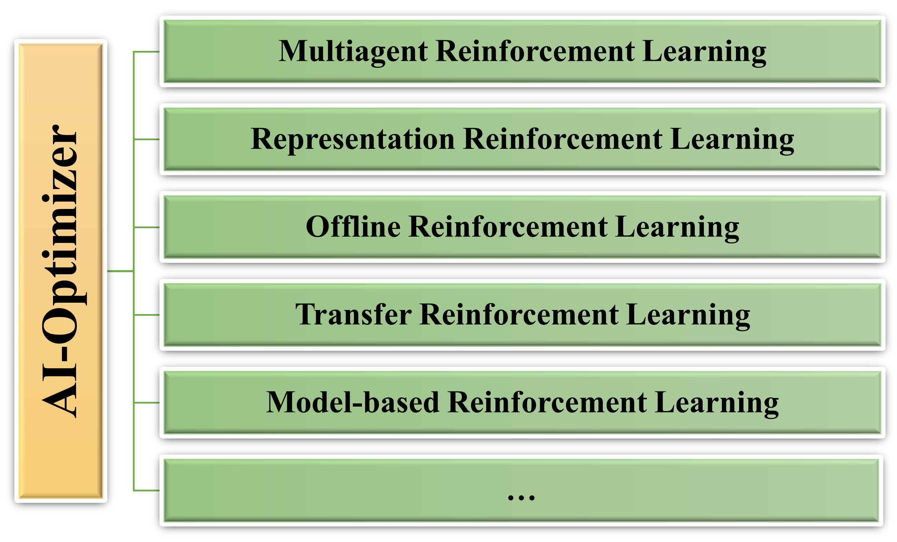

# AI-Optimizer
AI-Optimizer is a next generation deep reinforcement learning suit, privoding rich algorithm libraries ranging from model-free to model-based RL algorithms, from single-agent to multi-agent algorithms. Moreover, AI-Optimizer contains a flexible and easy-to-use distributed training framekwork for efficient policy training.  

For now, AI-Optimizer privodes following built-in libraries and more libraries and implementations are comming soon.
- [Multiagent Reinforcement learning](marl)
- [Self-supervized Representation Reinforcement Learning](ssrl)
- [Offline Reinforcement Learning](offline-rl-algorithms)
- [Transfer Reinforcement Learning](transferrl)
- [Model-based reinforcement learning](mbrl)

## Multiagent Reinforcement Learning (MARL)
MARL repo contains the released codes of representative research works of TJU-RL-Lab on the topic of Multiagent Reinforcement Learning (MARL). The research topics are classified according to the critical challenges of MARL, e.g., the curse of dimensionality (scalability) issue, non-stationarity, multiagent credit assignment, exploration–exploitation tradeoff and hybrid action. see more [here](https://github.com/TJU-DRL-LAB/MARL)

## Offline-rl-algorithms (Offrl)
Offline-rl-algorithms is a xxx

## Self-supervised Reinforcement Learning (SSRL)
SSRL repo contains the released codes of representative research works of TJU-RL-Lab on the topic of Self-supervised Representation Learning for RL. Since the RL agent always receives, processes and delivers all kinds of data in the learning process (i.e., the typical Agent-Environment Interface), 
how to **properly deal with such "data"** is naturally one key point to the effectiveness and efficiency of RL.

In this branch, we focus on three key questions:
- **What should a good representation for RL be?**
- **How can we obtain or realize such good representations?**
- **How can we making use of good representations to improve RL?**

Taking **Self-supervised Learning** (SSL) as our major paradigm for representation learning, we carry out our studies from four perspectives: 
**State Representation**,
**Action Representation**,
**Policy Representation**,
**Environment (and Task) Representation**.

## transfer reinforcement learning

## model-based reinforcement learning 
This repo contains a unified opensource code implementation for the Model-Based Reinforcement Learning methods. MBRL-Lib provides implementations of popular MBRL algorithms as examples of how to use this library. Currently, we have implemented Dreamer, MBPO, MuZero and we plan to keep increasing this list in the future. **We present one of the most comprehensive Model-Based  library so far , which covered most mainstream algorithms in Model-Based RL area.** This repo will be constantly updated to include new researches made by TJU-DRL-Lab. 

# Contributing
AI-Optimizer is still under development. More algorithms and features are going to be added and we always welcome contributions to help make AI-Optimizer better. Feel free to contribute.
