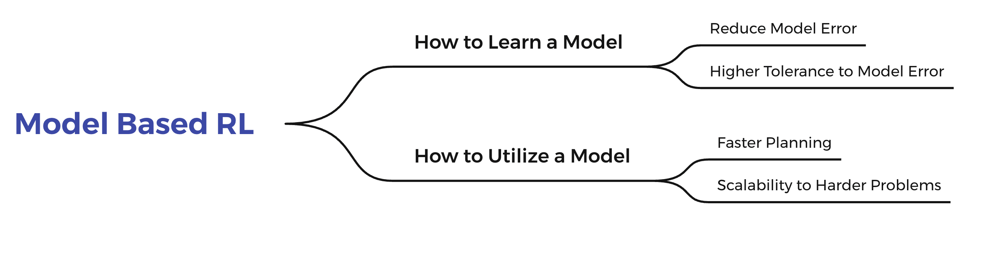

# MBRL-Lib


This repo contains a unified opensource code implementation for the Model-Based  Reinforcement Learning methods.(@TJU). MBRL-Lib provides implementations of popular MBRL algorithms as examples of how to use this library. You can find them in the MBRL-Lib folder. Currently, we have implemented Dreamer, MBPO, MuZero, we plan to keep increasing this list in the future. **We present one of the most comprehensive Model-Based  library so far , which covered most mainstream algorithms in Model-Based RL area.** This repo will be constantly updated to include new researches made by TJU-RL-Lab. (The development of this repo is in progress at present.)

## Introduction

Reinforcement learning algorithms can be divided into two main categories: **the first category is `Model Free` methods, which are able to learn a value function or a strategy function directly by interacting with the environment without modeling the environment; the second category is `Model Based` methods, which need to model the environment by interacting with it and then use the model to make action planning or strategy selection**. The model free algorithm has achieved great results in many experimental scenarios and game environments due to its simple implementation and high asymptotic performance, but the sampling efficiency of the model free method is extremely low, resulting in a large number of interactions with the environment. However, the model free class of methods is extremely inefficient in terms of sampling efficiency and requires a lot of interaction with the environment. In contrast, the model-based algorithm models the environment and fits the dynamics model of the environment **with high sampling efficiency**.


The model of the environment is a representation model that explicitly contains knowledge about the environment or the task, and generally two types of models are included: a transition model or a dynamics model and the reward model. Once this model is modeled, it can be properly integrated into the interaction with the environment and the learning of strategies, as shown in the above figure. There are many different ways to classify the mainstream algorithms in the modern Model-Based RL area. From the mainstream viewpoint,  we can simply divide `Model-Based RL` into two categories: `How to Learn a Model` and `How to Utilize a Model`.

- `How to Learn a Model` mainly focuses on how to build the environment model. 

- `How to Utilize a Model` cares about how to utilize the learned model. 

From the perspective of action execution, we can also divide `Model-Based RL` into two categories: `policy learning` and `planning`. 

- `policy learning` mainly focuses on training a parametric policy network explicitly. 

- `planning` cares about how to optimize the action sequence implicitly.

There are many other classifications and we can list some of them here. From the perspective of the dynamics model, we can divide dynamics models into three categories:`forward model`、`reverse/backward model,` and `inverse model`. From the perspective of the estimation method, the methods can be categorized as`parametric ` and `non-parametric` or `exact` and `approximate`. From the perspective of planning updating, the methods can be categorized as `value update ` and `policy update`.

The current classifications of the mainstream algorithms in the modern Model-Based RL area are orthogonal, which means some algorithms can be grouped into different categories according to different perspectives. It’s quite hard to draw an accurate taxonomy of algorithms in the Model-Based RL area.  **So we think it would be more appropriate to give the algorithm to a specific topic rather than a simple classification.** Ignoring the differences in specific methods, the purpose of MBRL algorithms can be more finely divided into four directions as follows: `Reduce Model Error`、`Faster Planning`、` Higher Tolerance to Model Error` 、`Scalability to Harder Problems`.  For the problem of `How to Learn a Model`, we can study reducing model error to learn a more accurate world model or learning a world model with higher tolerance to model error. For the problem of `How to Utilize a Model`, we can study faster planning with a learned model or the scalability of the learned model to harder problems.  



Moreover, we will publish a series of related blogs to explain more Model-Based RL algorithms. For a more detailed tutorial of this taxonomy, we refer the reader to our [ZhiHu blog series](https://zhuanlan.zhihu.com/p/425318401).

## An Overall View of Research Works in This Repo

| Topic                           | Approach                | Method         | Is Contained | Is ReadME Prepared | Publication | Link                                                         |
| ------------------------------- | :---------------------- | :------------- | :----------: | :----------------: | :---------: | :----------------------------------------------------------- |
| Reduce  Model Error             | Analytical  Gradient    | Dreamer        |      ✅       |         ✅          |  ICLR 2020  | [Dream to control: Learning behaviors by latent imagination](https://arxiv.org/pdf/1912.01603.pdf) |
| Reduce  Model Error             | Dyna-style              | MBPO           |      ✅       |         ✅          |  NIPS 2019  | [When to Trust Your Model: Model-Based Policy Optimization](https://arxiv.org/pdf/1906.08253.pdf) |
| Higher Tolerance to Model Error | Dyna-style              | BMPO           |      ✅       |         ✅          |  ICML 2020  | [Bidirectional Model-based Policy Optimization](https://arxiv.org/pdf/2007.01995.pdf) |
| Reduce  Model Error             | Dynamics Decomposition  | ED2            |      ✅       |         ✅          | In progress | [ED2: An Environment Dynamics Decomposition Framework for World Model Construction](https://arxiv.org/abs/2112.02817) |
| Reduce  Model Error             | Planning                | PlaNet         |      ✅       |         ✅          |  ICML 2020  | [Learning Latent Dynamics for Planning from Pixels](https://arxiv.org/pdf/1811.04551.pdf) |
| Faster Planning                 | Planning                | MuZero         |      ✅       |         ✅          |   Nature    | [Mastering Atari, Go, Chess and Shogi by Planning with a Learned Model](https://arxiv.org/pdf/1911.08265.pdf) |
| Faster Planning                 | Planning                | Sampled MuZero |      ❌       |         ❌          |  ICML 2021  | [Learning and Planning in Complex Action Spaces](http://arxiv.org/abs/2104.06303) |
| Scalability to Harder Problems  | Dynamics generalization | CaDM           |      ✅       |         ✅          |  ICML 2020  | [Context-aware Dynamics Model for Generalization in Model-Based Reinforcement Learning](https://arxiv.org/pdf/2005.06800.pdf) |
| Scalability to Harder Problems  | Dynamics generalization | TMCL           |      ❌       |         ❌          |  NIPS 2020  | [Trajectory-wise Multiple Choice Learning for Dynamics Generalization in Reinforcement Learning](https://arxiv.org/pdf/2010.13303.pdf) |

# Method

- #### Dreamer

  - Vanilla Dreamer

    Dreamer, a reinforcement learning agent that solves long-horizon tasks from images purely by latent imagination and learns behaviors by propagating analytic gradients of learned state values back through trajectories imagined in the compact state space of a learned world model.

  - ED2 Dreamer

    Environment Dynamics Decomposition (ED2), a novel world model construction framework that models the environment in a decomposing manner.

- #### MBPO

  - Vanilla MBPO

    Model-Based Policy Optimization using short model-generated rollouts branched from real data has the benefits of more complicated model-based algorithms without the usual pitfalls.

  - ED2 MBPO

    Environment Dynamics Decomposition (ED2), a novel world model construction framework that models the environment in a decomposing manner.


- #### MuZero

  Mastering Atari , Go, Chess and Shogi by Planning with a Learned Model. MuZero is a series of work produced by DeepMind.

- #### BMPO

  Bidirectional Model-based Policy Optimization. a backward dynamics model to reduce the reliance on accuracy in forward model predictions called Bidirectional Model-based Policy Optimization (BMPO) to utilize both the forward model and backward model to generate short branched rollouts for policy optimization.

- #### PlaNet

  Learning Latent Dynamics for Planning from Pixels. Deep Planning Network (PlaNet), a purely model-based agent that learns the environment dynamics from images and chooses actions through fast online planning in latent space.

- #### CaDM

  Context-aware Dynamics Model for Generalization in Model-Based Reinforcement Learning.A state-of-the-art model-based RL method for dynamics generalization.

## Installation

The algorithms in this repo are all implemented **python 3.5** (and versions above). 
**Tensorflow 1.x**  and **PyTorch** are the main DL code frameworks we adopt in this repo with different choices in different algorithms.

First of all, we recommend the user to install **anaconada** and or **venv** for convenient management of different python envs.

In this repo, the following RL environments may be needed:

- [OpenAI Gym](https://github.com/openai/gym) (e.g., MuJoCo, Robotics)
- [MinAtar](https://github.com/kenjyoung/MinAtar)
- xxxx

Note that each algorithm may use only one or several environments in the ones listed above. Please refer to the page of specific algorithm for concrete requirements.

To clone this repo:

```
git clone git@github.com:TJU-DRL-LAB/modelbased-rl.git
```

Note that this repo is a collection of multiple research branches (according to the taxonomy). 
Environments and code frameworks may differ among different branches. Thus, please follow the installation guidance provided in the specific branch you are insterested in.

## Usage

First follow the vanilla Dreamer and MBPO method and run the baselines (we introduced them in Dreamer/README.md and MBPO/README.md). Then run ED2-Dreamer or ED2-MBPO (following the detail operation in ED2-Dreamer/README.md or ED2-MBPO/README.md).
In addition, we provide codes for Muzero, one of the most classic baseline for planning method.

If you have useful suggestions, don't hesitate to raise an issue or submit a pull request!

## TODO

- [ ] Update a liscence
- [ ] Update the README files for each branches
- [ ] Check the vadality of codes to release

## Citation

If you use our repo in your work, we ask that you cite our **paper**. 

Here is an example BibTeX:

```
@article{wang2021ed2,
  title={ED2: An Environment Dynamics Decomposition Framework for World Model Construction},
  author={Wang, Cong and Yang, Tianpei and Hao, Jianye and Zheng, Yan and Tang, Hongyao and Barez, Fazl and Liu, Jinyi and Peng, Jiajie and Piao, Haiyin and Sun, Zhixiao},
  journal={arXiv preprint arXiv:2112.02817},
  year={2021}
}
@article{tjurllab22modelbasedrl,
  author    = {TJU RL Lab},
  title     = {A Unified Repo for Model-based Reinforcement Learning},
  year      = {2022},
  url       = {https://github.com/TJU-DRL-LAB/modelbased-rl},
}
```

## Liscense

**[To change]**

This program is free software: you can redistribute it and/or modify it under the terms of the GNU General Public License as published by the Free Software Foundation, either version 3 of the License, or (at your option) any later version.

This program is distributed in the hope that it will be useful, but WITHOUT ANY WARRANTY; without even the implied warranty of MERCHANTABILITY or FITNESS FOR A PARTICULAR PURPOSE. See the GNU General Public License for more details.

You should have received a copy of the GNU General Public License along with this program. If not, see http://www.gnu.org/licenses/.

## Acknowledgment

**[To add some acknowledgment]**

