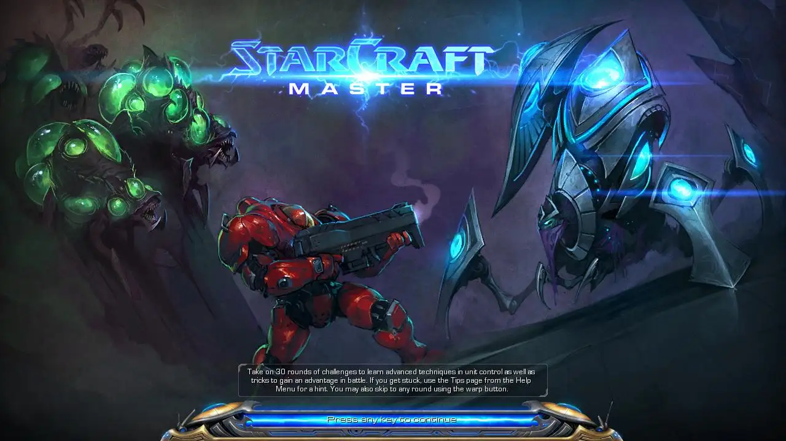
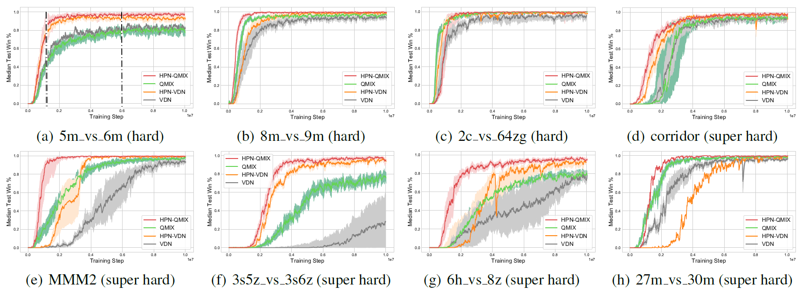
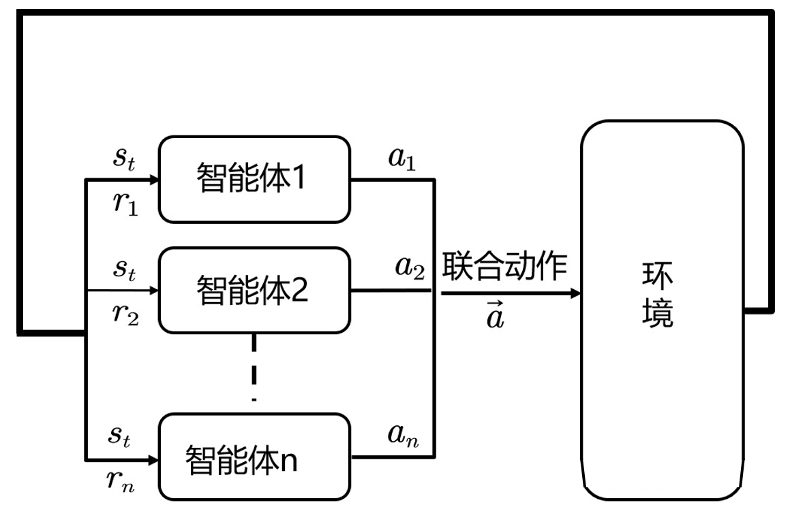
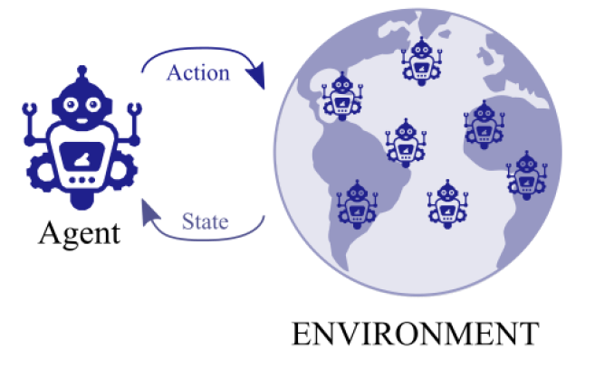

# Multiagent RLlib: A unified official code releasement of MARL researches made by TJU-RL-Lab

This repository contains the released codes of representative research works of TJU-RL-Lab on the topic of Multiagent Reinforcement Learning (MARL). The research topics are classified according to the critical challenges of MARL, e.g., the curse of dimensionality (scalability) issue,  non-stationarity, multiagent credit assignment, exploration–exploitation tradeoff and hybrid action. A big picture is shown bellow. 

This repository will be constantly updated to include new research works.  

## 1. Key Features

### :rocket: State-Of-The-Art Performance

- **[API-QMIX](https://arxiv.org/pdf/2203.05285.pdf)**: the **state-of-the-art** MARL algorithm in the [StarCraft Multi-Agent Challenge (SMAC)](https://github.com/oxwhirl/smac) benchmark. 

  - paper link: https://arxiv.org/pdf/2203.05285.pdf

  - [SMAC](https://github.com/oxwhirl/smac) is WhiRL's environment for research in the field of collaborative multi-agent reinforcement learning (MARL) based on Blizzard's StarCraft II RTS game. SMAC makes use of Blizzard's StarCraft II Machine Learning API and DeepMind's PySC2 to provide a convenient interface for autonomous agents to interact with StarCraft II, getting observations and performing actions. SMAC concentrates on decentralised micromanagement scenarios, where each unit of the game is controlled by an individual RL agent

    

  - Performance of our API-QMIX and API-VDN (named HPN-QMIX and HPN-VDN in the figure) in SMAC.

## 2. Challenges of MARL

Multiagent systems consist of multiple agents acting and learning in a shared environment. Many real-world decision making problems can be modeled as multiagent systems, such as playing the game of Go, playing real-time strategy games, robotic control, playing card games, autonomous vehicles, resource allocation problems. Despite the recent success of deep RL in single-agent environments, there are additional challenges in multiagent RL:

- **The curse of dimensionality (scalability) issue**: In MARL, the joint state-action space grows exponentially as the number of agents increases. This is also referred to as the combinatorial nature of MARL. Thus, MARL algorithms typically suffer from **poor sample-efficiency** and **poor scalability** due to the exponential grows of the dimensionality. The key to solve this problem is to reduce the size of the state-action space properly. 

- **Non-stationarity** (especially for independent learners): In Markov games, the state transition function and the reward function of each agent depend on the actions of all agents. During the training of multiple agents, the policy of each agent changes through time. As a result, each agents’ perceived transition and reward functions change as well, which causes the environment faced by each individual agent to be non-stationary and breaks the Markov assumption that governs the convergence of most single-agent RL algorithms. In the worst case, each agent can enter an endless cycle of adapting to other agents. 

  

- **Multiagent credit assignment problem**: for cooperative Markov games, all agents could only receive a shared team reward. However, in most cases, only a subset of agents contribute to the reward, and we need to identify which agents contribute more (less) and reward (punish) them accordingly. The target is then guide the less contributed agents to contribute more and thus the team reward could be further improved.

- **Exploration–exploitation tradeoff**:  compared with the single-agent settings, the presence of multiple agents further makes the problem more complicated. First, due to the curse of dimensionality, the search space grows larger. Second, the agents explore to obtain information not only about the environment, but also about the other agents. Too much exploration, however, can disturb the learning dynamics of the other agents, thus making the learning task more difficult, especially for the cases that the agents’ choices of actions must be mutually consistent in order to achieve better rewards. Thus, coordinated exploration is needed.

- **Hybrid action**: Discrete-continuous hybrid action space is a natural setting in many practical problems, such as robot control and game AI. However, most previous Reinforcement Learning (RL) works only demonstrate the success in controlling with either discrete or continuous action space, while seldom take into account the hybrid action space.  For example, in robot soccer, the agent not only needs to choose whether to shoot or pass the ball (i.e., discrete actions) but also the associated angle and force (i.e., continuous parameters).

- **Partial observability**: In most real-world applications, the agents only have access to their local observations and not the actual state of the environment, which can significantly hinder training performance.

## 3. Our Solutions

To solve the above problems, we propose a series of algorithms from different point of views. A big picture is shown bellow. Detailed structure of this repository will be list in the next section.

## 4. Directory Structure of this Repo

an overall view of research works in this repo

| Category          | Sub-Categories                                   | Research Work (Conference) | Progress |
| :-------------------------- | :---------------------------------------------------------- | :----------------------------------- | ------------------------------------ |
| **scalability** | **scalable multiagent network**     (1) permutation invariant (equivariant)        (2) action semantics     (3) Game abstraction      (4) dynamic agent-number network  **hierarchical MARL**  | (1) [API (underreview) [1]](https://arxiv.org/pdf/2203.05285.pdf)  (2) [ASN (ICLR-2020) [2]](https://openreview.net/forum?id=ryg48p4tPH) (3) [G2ANet (AAAI-2020) [3]](https://ojs.aaai.org/index.php/AAAI/article/view/6211)  (4) [DyAN (AAAI-2020) [4]](https://ojs.aaai.org/index.php/AAAI/article/view/6221) (5) [HIL/HCOMM/HQMIX (Arxiv) [5]](https://arxiv.org/pdf/1809.09332.pdf?ref=https://githubhelp.com) | :white_check_mark: (5):no_entry:  |
| **credit_assignment**       |                                                             | (1) [QPD (ICML-2020) [6]](http://proceedings.mlr.press/v119/yang20d/yang20d.pdf)  (2) [Qatten (Arxiv) [7]](https://arxiv.org/abs/2002.03939) | :white_check_mark: |
| **non-stationarity**       | (1) self_imitation_learning (2) opponent modeling  | (1) [GASIL (AAMAS-2019) [8]](https://www.ifaamas.org/Proceedings/aamas2019/pdfs/p1315.pdf) (2) [BPR+ (NIPS-2018) [9]](https://proceedings.neurips.cc/paper/2018/file/85422afb467e9456013a2a51d4dff702-Paper.pdf) (3) [DPN-BPR+ (AAMAS2020) [10]](https://link.springer.com/article/10.1007/s10458-020-09480-9)  (4) [WDDQN ](https://arxiv.org/abs/1802.08534)   | :white_check_mark: :no_entry: :no_entry: :no_entry: |
| **multiagent_exploration**  |                                                             | [PMIC (NIPS-2021 workshop) [11]](https://www.cooperativeai.com/neurips-2021/workshop-papers) | :no_entry:           |
| **hybrid_action**           |                                                             | [MAPQN/MAHHQN (IJCAI-2019) [12]](https://arxiv.org/pdf/1903.04959.pdf?ref=https://githubhelp.com) | :no_entry:                |
| **negotiation**    |                                                        |  | :no_entry: |

## 5. Publication List

**Scalability issue**

[1] Hao X, Wang W, Mao H, et al. API: Boosting Multi-Agent Reinforcement Learning via Agent-Permutation-Invariant Networks[J]. arXiv preprint arXiv:2203.05285, 2022.

[2] Wang W, Yang T, Liu Y, et al. Action Semantics Network: Considering the Effects of Actions in Multiagent Systems[C]//International Conference on Learning Representations. 2019.

[3] Liu Y, Wang W, Hu Y, et al. Multi-agent game abstraction via graph attention neural network[C]//Proceedings of the AAAI Conference on Artificial Intelligence. 2020, 34(05): 7211-7218.

[4] Wang W, Yang T, Liu Y, et al. From few to more: Large-scale dynamic multiagent curriculum learning[C]//Proceedings of the AAAI Conference on Artificial Intelligence. 2020, 34(05): 7293-7300.

[5] Tang H, Hao J, Lv T, et al. Hierarchical deep multiagent reinforcement learning with temporal abstraction[J]. arXiv preprint arXiv:1809.09332, 2018.

**Credit assignment**

[6] Yang Y, Hao J, Chen G, et al. Q-value path decomposition for deep multiagent reinforcement learning[C]//International Conference on Machine Learning. PMLR, 2020: 10706-10715.

[7] Yang Y, Hao J, Liao B, et al. Qatten: A general framework for cooperative multiagent reinforcement learning[J]. arXiv preprint arXiv:2002.03939, 2020.

**Non-stationarity**

[8] Hao X, Wang W, Hao J, et al. Independent generative adversarial self-imitation learning in cooperative multiagent systems[J]. arXiv preprint arXiv:1909.11468, 2019.

[9] Zheng Y, Meng Z, Hao J, et al. A deep bayesian policy reuse approach against non-stationary agents[J]. Advances in neural information processing systems, 2018, 31.

[10] Zheng Y, Hao J, Zhang Z, et al. Efficient policy detecting and reusing for non-stationarity in markov games[J]. Autonomous Agents and Multi-Agent Systems, 2021, 35(1): 1-29.

**Multiagent exploration**

[11] Li P, Tang H, Yang T, et al. PMIC: Improving Multi-Agent Reinforcement Learning with Progressive Mutual Information Collaboration[J]. 2021.

**Hybrid action**

[12] Fu H, Tang H, Hao J, et al. Deep multi-agent reinforcement learning with discrete-continuous hybrid action spaces[C]//Proceedings of the 28th International Joint Conference on Artificial Intelligence. 2019: 2329-2335.

