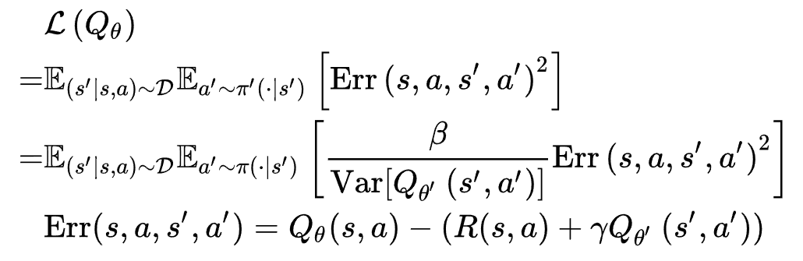
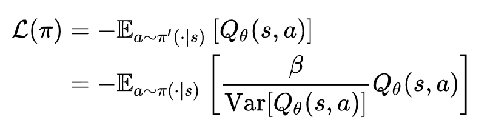

# 1. Introduction

Uncertainty Weighted Actor-Critic (UWAC) is an offline Reinforcement Learning algorithm, which detects OOD state-action pairs and down-weights their contribution in the training objectives accordingly. In offline Reinforcement Learning, whether the data is OOD can be judged by estimating the epistemic uncertainty. Further, using the estimated uncertainty as a regularization term for training critic penalizes the Q-value of OOD data. However, such an approach would limit the generalization ability of the Q function. Therefore, based on the BEAR algorithm, UWAC [1] is proposed to penalize the Q-value of OOD data by using the estimated uncertainty as weights to reduce the weights of updating from OOD samples. UWAC first uses MC-dropout to estimate the uncertainty, and further uses the weighted loss as shown below for RL learning.






# 2. Instruction

```
python uwac-train.py --dataset=walker2d-random-v2 --seed=0 --gpu=0
```

# 3. Performance

# 4. Reference

1. Wu, Yue, et al. "Uncertainty Weighted Actor-Critic for Offline Reinforcement Learning." International Conference on Machine Learning. PMLR, 2021.
