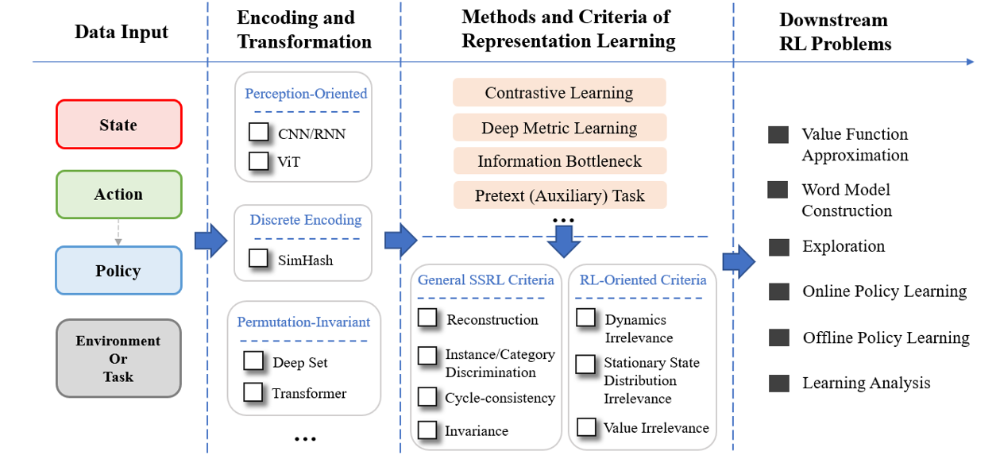

# **Self-supervised RL**: A Unified Algorithmic Framework & Opensource Code Implementation of Algorithms for Self-supervised Reinforcement Leanring (SSRL) with Representations

This repo contains representative research works of TJU-RL-Lab on the topic of Self-supervised Representation Learning for RL.

This repo will be constantly updated to include new researches made by TJU-RL-Lab. 
(The development of this repo is in progress at present.)


## Introduction
Reinforcement Learning (RL) is a major branch of Machine Learning, with expertise in solving sequential decision-making problems.
Following the typical paradigm of Agent-Environment Interface, 
an RL agent interacts with the environment by performing its policy and receiving environmental states (or observations) and rewards.
The agent's purpose is to maximize its expected discounted cumulative rewards, through trial-and-error.

Since the RL agent always receives, processes and delivers all kinds of data in the learning process, 
how to **properly deal with such "data"** is naturally one key point to the effectiveness and efficiency of RL.
In general, whenever you are dealing with high-dimensional or complex data (note that even the dimensionality is low, the data can also be complex to our learning problem), 
or in another word we may call it "not well represented", we often need good representation of data.

One may be familiar to many examples in Computer Vision (CV) and Natural Language Processing (NLP).
In recent years, **Self-supervised Learning** (SSL) prevails in CV and NLP, boosting great advances in unsupervised pre-training, large model and etc. 
In most cases mentioned above, the main idea of SSL is to **learn good representation without supervisions**, 
which is often done by optimizing various pretext tasks (i.e., auxiliary tasks), e.g., reconstruction, prediction and contrast.
Now, we focus on the representations in RL, seeking for an answer to the question above - **"how to properly consider learn/use representations for RL"**.

Among possible representations in RL, state representation is one major branch.
The researches on state representation dates back to heuristic representations in linear approximation, 
state abstraction theories & methods in the early 21th century (actually even earlier).
New advances on state representation are also emerging in recent years, mainly to deal with high-dimensional states (or observations), e.g., image inputs.

In our framework, we focus on three key questions:
- **What should a good representation for RL be?**
- **How can we obtain or realize such good representations?**
- **How can we making use of good representations to improve RL?**

We view the three questions above as a general guidance for our researches.


### Taxonomy of SSRL
This repo follow a systematic taxnomy of Self-supervised RL with Representations proposed by TJU-RL-Lab, which consists of:
- SSRL with State Representation
- SSRL with Action Representation
- SSRL with Policy Representation
- SSRL with Environment (and Task) Representation
- SSRL with Other Representation

For a tutorial of this taxnomy, we refer the reader to our [ZhiHu blog series](https://zhuanlan.zhihu.com/p/413321572).


### A Unified Algorithmic Framework (Implementation Design) of SSRL Algorithm

All SSRL algorithms with representation in our taxonmy follows the same algorithmic framework.  
The illsutration of our Unified Algorithmic Framework (Implementation Design) of SSRL Algorithm is shown below.
From left to right, the framework consists of four phases:
- **Data Input**
- **Encoding and Transformation**
- **Methods and Criteria of Representation Learning**
- **Downstream RL Problems**

The unified framework we propose is general. Almost all currently existing SSRL algorithms can be interpreted with our framework. 
In turn, this unified framework can also serve as a guidance when we are working on designing a new algorithm.

<div align=center></div>


### Ecology of SSRL

Beyond the opensource of our research works, we plan to establish the ecology of SSRL in the future.
Driven by **three key fundamental challenges of RL**, we are working on research explorations at the frontier 
**from the different perspectives of self-supervised representation in RL**.
For algorithms and methods proposed, we plan to study **a unified algorithmic framework** togather with **a unified opensource code-level implementation framework**.
These representations are expected to **boost the learning in various downstream RL problems**, in straightforward or sophatiscated ways.
Finally, our ultimate goal is to **land self-supervised representation driven RL in real-world decision-making scenarios**.

<div align=center></div>

## Installation

The algorithms in this repo are all implemented **python 3.5** (and versions above). 
**Tensorflow 1.x** and **PyTorch** are the main DL code frameworks we adopt in this repo with different choices in different algorithms.

First of all, we recommend the user to install **anaconada** and or **venv** for convenient management of different python envs.

In this repo, the following RL environments may be needed:
- [OpenAI Gym](https://github.com/openai/gym) (e.g., MuJoCo, Robotics)
- [MinAtar](https://github.com/kenjyoung/MinAtar)
- ......
- And some environments designed by ourselves.

Note that each algorithm may use only one or several environments in the ones listed above. Please refer to the page of specific algorithm for concrete requirements.

To clone this repo:

```
git clone http://rl.beiyang.ren/tju_rl/self-supervised-rl.git
```

Note that this repo is a collection of multiple research branches (according to the taxonomy). 
Environments and code frameworks may differ among different branches. Thus, please follow the installation guidance provided in the specific branch you are insterested in.


## An Overall View of Research Works in This Repo  


| Category | Method | Is Contained | Is ReadME Prepared | Author | Publication | Link |
| ------ | ------ | --- | --- | ------ | ------ | ------ |
| Action | HyAR |✅ | ✅  |  Boyan Li | ICLR 2022 | https://openreview.net/forum?id=64trBbOhdGU |
| Policy | PPO-PeVFA | ✅ | ✅ | Hongyao Tang  |AAAI 2022 | https://arxiv.org/abs/2010.09536 |
| Env&task | CCM | ❌ | ❌ |Haotian Fu | AAAI 2021 | https://ojs.aaai.org/index.php/AAAI/article/view/16914 |
| Env&task | PAnDR |✅ | ❌ |Tong Sang| [ICLR 2022 GPL Workshop](https://ai-workshops.github.io/generalizable-policy-learning-in-the-physical-world/) | https://arxiv.org/abs/2204.02877 |
| Other | VDFP |✅ | ✅ |Hongyao Tang| AAAI 2021 | https://ojs.aaai.org/index.php/AAAI/article/view/17182 |


## TODO

- [ ] Update the README files for each branch

## Liscense

This repo uses [MIT Liscense](https://github.com/TJU-DRL-LAB/self-supervised-rl/blob/main/LICENSE).

## Citation

If this repository has helped your research, please cite the following:
```
@article{tjurllab22ssrl,
  author    = {TJU RL Lab},
  title     = {A Unified Repo for Self-supervised RL with Representations},
  year      = {2022},
  url       = {https://github.com/TJU-DRL-LAB/self-supervised-rl},
}
```


## Major Update Log
2022-04-07:
- Readme files updated for several branches (state/environment representation).
- Codes of our work PAnDR are uploaded. 


2022-03-24:
- Readme files updated for several branches (action/policy/other representation) and individual works (VDFP/HyAR/PeVFA).

2022-03-18:
- Main page readme uploaded.
- VDFP, HyAR, PeVFA codes - first commit.
