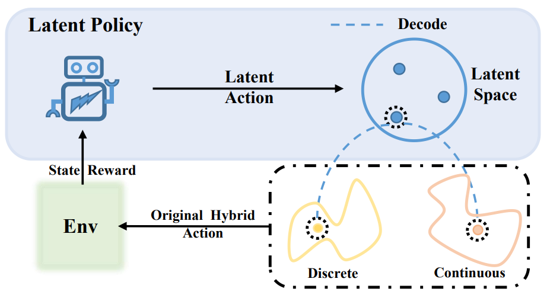

# ICLR 2022-Hybrid Action Representation (HyAR)

This is the official implementation of 
our work [HyAR: Addressing Discrete-Continuous Action Reinforcement Learning via Hybrid Action Representation](https://openreview.net/forum?id=64trBbOhdGU)
accepted on ICLR 2022.

## Introduction

Discrete-continuous hybrid action space is a natural setting in many practical problems, such as robot control and game AI. However, most previous Reinforcement Learning (RL) works only demonstrate the success in controlling with either discrete or continuous action space, while seldom take into account the hybrid action space. 

One naive way to address hybrid action RL is to convert the hybrid action space into a unified homogeneous action space by discretization or continualization, so that conventional RL algorithms can be applied. 
However, this **ignores the underlying structure of hybrid action space** and also induces the scalability issue and additional approximation difficulties, thus leading to degenerated results. 

In this work, we propose **Hybrid Action Representation (HyAR)** to learn a **compact** and **decodable** latent representation space for the original hybrid action space:
- HyAR constructs the latent space and embeds the dependence between discrete action and continuous parameter via an embedding table and conditional Variantional Auto-Encoder (VAE).
- To further improve the effectiveness, the action representation is trained to be semantically smooth through unsupervised environmental dynamics prediction.
- Finally, the agent then learns its policy with conventional DRL algorithms in the learned representation space and interacts with the environment by decoding the hybrid action embeddings to the original action space. 

A conceptual illustration is shown below.

<div align=center></div>


## Related Work

This repo includes several reinforcement learning algorithms for hybrid action space MDPs:
1. HPPO[[Fan et al. 2018]](https://arxiv.org/abs/1903.01344v3)
2. MAHHQN[[Fu et al. 2018]](https://arxiv.org/abs/1903.04959)
3. P-DQN [[Xiong et al. 2018]](https://arxiv.org/abs/1810.06394)
4. PA-DDPG [[Hausknecht & Stone 2016]](https://arxiv.org/abs/1511.04143)


## Repo Content

### Folder Description
- gym-goal, gym-platform, and multiagent: The environments with hybrid action spaces adopted in our work
- agents：Policy of all algorithms, including pdqn, paddpg, hhqn (benchmark policys) ...; pdqn_MPE, pdqn_MPE_4_direction(random policys)...;
  Note: The difference between all random policys is only in the hybrid action dimension.
- HyAR_RL: HyAR-TD3 (TD3 based) and HyAR-DDPG (DDPG based) algorithms training process.
- Raw_RL: HHQN PDQN PADDPG PATD3 and HPPO algorithms training process

### Domains

Experiment scripts are provided to run each algorithm on the following domains with hybrid actions:

- Platform (https://github.com/cycraig/gym-platform)
- Robot Soccer Goal (https://github.com/cycraig/gym-goal)
- Catch Point (mimic implementation of the environment used in HPPO[[Fan et al. 2018]](https://arxiv.org/abs/1903.01344v3))
- Hard Goal (designed by us, developed based on Robot Soccer Goal)
- Hard Move (designed by us, inspired by the environment used in [Chandak et al. (ICML 2019)](http://proceedings.mlr.press/v97/chandak19a.html))


## Installation

Here is an ancient installation guidance which needs step-by-step installation. A more automatic guidance with pip will be considered in the future.

We recommend the user to install **anaconada** and or **venv** for convenient management of different python envs.

### Dependencies

- Python 3.6+ (tested with 3.6 and 3.7)
- pytorch 0.4.1+
- gym 0.10.5
- numpy
- click
- pygame
- numba

## Example Usage

HyAR_RL:
```bash
python main_embedding_platform_td3.py
python main_embedding_platform_ddpg.py
```
Raw_RL:
```bash
python main_platform_td3.py 
python main_platform_ddpg.py
```

We refer the user to our paper for complete details of hyperparameter settings and design choices.

## TO-DO
- [ ] Tidy up redundant codes

## Citation
If this repository has helped your research, please cite the following:
```bibtex
@inproceedings{li2022hyar,
  title     = {Hy{AR}: Addressing Discrete-Continuous Action Reinforcement Learning via Hybrid Action Representation},
  author    = {Boyan Li and Hongyao Tang and YAN ZHENG and Jianye HAO and Pengyi Li and Zhen Wang and Zhaopeng Meng and LI Wang},
  booktitle = {International Conference on Learning Representations},
  year      = {2022},
  url       = {https://openreview.net/forum?id=64trBbOhdGU}
}
```
