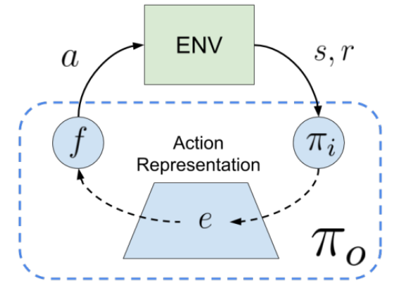

# RL with Action Representation

Action Representation is one major category in our taxonomy. 
The core research content of action representation is to discover or learn **well-behaved representation for actions**, which is significant to RL in _complex action space_.

In this repo, we use _complex action space_ to denote the action spaces which are often seen in practical decision-making problems while not that prevalent in current RL community.

We provide two representative complex action space here:
- **Large Action Space**: In many real-world scenarios, the action space can be very large, often larger than 10^3. For example, advertising of E-commerce, recommendation systems, multiagent systems (joint action space of multiple agents).
- **Sturctured Action Space**: In some other circumstances, the action space is not 'flat', which means an action consists of several components among which the dependencies and orders often exist. For example, discrete-continuous hybrid control in games or product systems.

Therefore, the aim of study on action representation is to find a better representation space which is **favorable to RL** over directly learning with original complex action space.

## Repo Content

This repo contains representative research works of TJU-RL-Lab on the topic of RL with Action Representation.
Currently, we focus on how to learn good action representation which can **boost RL in complex action space**.

### Learning in Latent Action Space

We use the following illustration to demonstrate a general paradigm of RL with Action Representation:

This illustration is originated from [Chandak et al. (ICML 2019)](http://proceedings.mlr.press/v97/chandak19a.html). 
Given a policy representation space, the illustration depicts the paradigme of latent policy learning, with the help of a _reversible_ action representation space.

## An Overall View of Research Works in This Repo  

This repo will be constantly updated to include new researches made by TJU-RL-Lab. 
(The development of this repo is in progress at present.)

| Method | Is Contained | Is ReadME Prepared | Author | Publication | Link |
| ------ | --- | --- | ------ | ------ | ------ |
| HyAR | ✅ | ✅ | Boyan Li  | ICLR 2022 | https://openreview.net/forum?id=64trBbOhdGU |

## Installation

The algorithms in this repo are all implemented **python 3.5** (and versions above). **Tensorflow 1.x** and **PyTorch** are the main DL code frameworks we adopt in this repo with different choices in different algorithms.

Note that the algorithms contained in this repo may not use all the same environments. Please check the README of specific algorithms for detailed installation guidance.

## TODO
- [x] Update README file for HyAR
- [ ] Tidy up code of HyAR

## Related Work

Here we provide a useful list of representative related works on action representation and complex action space RL.

- Boyan Li, Hongyao Tang, Yan Zheng, Jianye Hao, Pengyi Li, Zhen Wang, Zhaopeng Meng, Li Wang. HyAR: Addressing Discrete-Continuous Action Reinf
orcement Learning via Hybrid Action Representation. ICLR 2022
- Wenxuan Zhou, Sujay Bajracharya, David Held. PLAS: Latent Action Space for Offline Reinforcement Learning. CoRL 2021
- William F. Whitney, Rajat Agarwal, Kyunghyun Cho, Abhinav Gupta. Dynamics-Aware Embeddings. ICLR 2020
- Yash Chandak, Georgios Theocharous, James Kostas, Scott M. Jordan, Philip S. Thomas. Learning Action Representations for Reinforcement Learning.
ICML 2019
