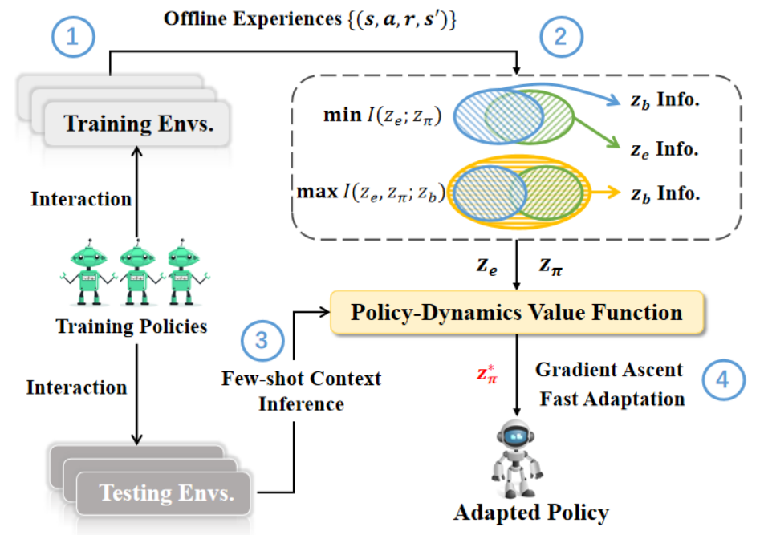

# IJCAI 2022-Policy Adaptation via Decoupled Policy and Environment Representations (PAnDR)

This is the official implementation of 
our work [PAnDR: Fast Adaptation to New Environments from Offline Experiences via Decoupling Policy and Environment Representations](https://arxiv.org/abs/2204.02877)
accepted on IJCAI 2022.
A preliminary version is also presented at ICLR 2022 Workshop on Generalizable Policy Leanring (GPL).

## Introduction

Deep Reinforcement Learning (DRL) has been a promising solution to many complex decision-making problems. Nevertheless, the notorious weakness in generalization among environments prevent widespread application of DRL agents in real-world scenarios. 
Although advances have been made recently, most prior works assume sufficient online interaction on training environments, which can be costly in practical cases. 
To this end, we focus on an **offline-training-online-adaptation** setting, in which the agent first learns from offline experiences collected in environments with different dynamics and then performs online policy adaptation in environments with new dynamics. 

In this paper, we propose Policy Adaptation with Decoupled Representations (PAnDR) for fast policy adaptation. 
- In offline training phase, the **environment representation** and **policy representation** are learned through _contrastive learning_ and _policy recovery_, respectively. The representations are further refined by _mutual information optimization_ to make them **more decoupled and complete**. With learned representations, a Policy-Dynamics Value Function (PDVF) (Raileanu et al., 2020) network is trained to approximate the values for different combinations of policies and environments. 
- In online adaptation phase, with the environment context inferred from few experiences collected in new environments, the policy is optimized by gradient ascent with respect to the PDVF.

A conceptual illustration is shown below.

<div align=center></div>

## Repo Content

### Folder Description
- ppo: implementation of PPO [[Schulman et al., 2017]](https://arxiv.org/abs/1707.06347), used to learn the policies of the training environments.
- myant, myswimmer, myspaceship: enviornments used in the experiments, from PDVF [[Raileanu et al., 2020]](https://arxiv.org/abs/2007.02879v1).
- env_utils.py: interact with the environment to collect data.
- pandr_storage.py: store data.
- pdvf_networks.py: network structure.
- train_utils.py: optimizer of model.
- pandr_arguments.py: parameters setting.
- train_utils.py: model save and load.
- main_train.py: contains training of encoder networks, training of value function network, policy optimization and testing.


### Domains and Environments

## Installation

We recommend the user to install **anaconada** and or **venv** for convenient management of different python envs.

### Dependencies

- Python 
- numpy
- gym
- mujoco-py
- baselines 0.1.6
- torch 1.7.1


### Environment Installation
```
cd myant 
pip install -e .  

cd myswimmer 
pip install -e .  

cd myspaceship 
pip install -e .  
```

## Example Usage

### (1) Offline Data Collection Phase 


For offline experiences, we first train a PPO policy for each environment. Each of the commands below need to be run for default-ind in [0,...,14] (15 training environments). The obtained policies are training policies that serve as the collectors of offline data. 

For each domain, 50-episode interaction trajectories are collected by each combination of training environment and training policy, e.g., 15 ∗ 15 ∗ 50 episodes of experiences collected in total for Ant-Wind.

#### Ant-wind
```
python ppo/ppo_main.py \
--env-name myant-v0 --default-ind 0 --seed 0 
```

### (2) PAnDR Training & Adaptation Phase

#### Ant-wind
```
# python main_train.py --env-name myant-v0 --op-lr 0.01 --num-t-policy-embed 50 --num-t-env-embed 1 --gd-iter 50 --norm-reward --min-reward -200 --max-reward 1000 --club-lambda 1000 --mi-lambda 1
```


We refer the user to our paper for complete details of hyperparameter settings and design choices.

## TO-DO
- [ ] Tidy up redundant codes

## Citation
If this repository has helped your research, please cite the following:
```bibtex
@inproceedings{sang2022pandr,
  title     = {PAnDR: Fast Adaptation to New Environments from Offline Experiences via Decoupling Policy and Environment Representations},
  author    = {Tong Sang, Hongyao Tang, Yi Ma, Jianye Hao, Yan Zheng, Zhaopeng Meng, Boyan Li, Zhen Wang},
  booktitle = {International Conference on Learning Representations Workshop on Generalizable Policy Learning},
  year      = {2022},
  url       = {https://arxiv.org/abs/2204.02877}
}
```

