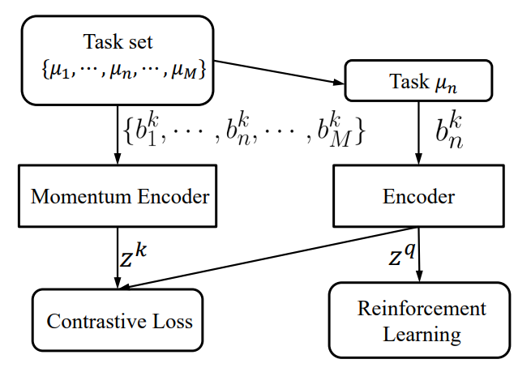
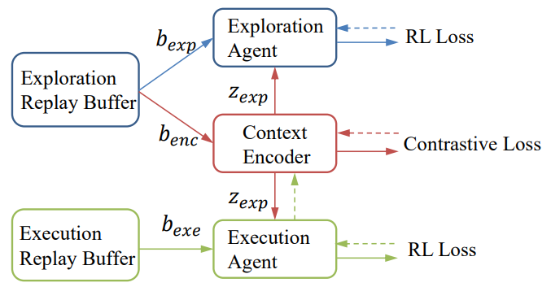

# AAAI 2021-Towards Effective Context for Meta-Reinforcement Learning: an Approach based on Contrastive Learning (CCM)

This is the official implementation of 
our work [Towards Effective Context for Meta-Reinforcement Learning: an Approach based on Contrastive Learning](https://ojs.aaai.org/index.php/AAAI/article/view/16914)
accepted on AAAI 2021.

## Introduction
Toward the generalization among environments and tasks, Context-based Meta-Reinforcement Learning (MetaRL) is a potential solution.
Context, the embedding of previous collected trajectories, is a powerful construct for MetaRL algorithms. 
By conditioning on an effective context, Meta-RL policies can easily generalize to new tasks within a few adaptation steps. 

We argue that improving the quality
of context involves answering two questions: 
- How to train a compact and sufficient encoder that can embed the taskspecific information contained in prior trajectories? 
- How to collect informative trajectories of which the corresponding context reflects the specification of tasks? 
To this end, we propose a novel Meta-RL framework called CCM (Contrastive learning augmented Context-based Meta-RL). 
The core ideas of CCM are Contrastive Context Representation and Contrast-driven Information Gain Exploration, to answer the two questions listed above respectively.

For Contrastive Context Representation, we first focus on the contrastive nature behind different tasks and leverage
it to train a compact and sufficient context encoder. The contrastive context encoder is depicted in the following.

<div align=center></div>

For Contrast-driven Information Gain Exploration, we train a separate exploration policy and theoretically derive
a new information-gain-based objective which aims to collect informative trajectories in a few steps.
The illustration of CCM training procedure is shown below, where dashed lines denote backward gradients.

<div align=center></div>


## Repo Content

### Folder Description
- configs: The configs to run different experiments
- rlkit：policies, samplers, networks, etc
- rand_param_envs: submodule rand_param_envs for a self-contained repo as in PEARL[[Rakelly et al., 2019]](https://arxiv.org/abs/1903.08254v1)

### Domains

Experiment scripts are provided to run our algorithm on the OpenAI gym, with the MuJoCo simulator, We further modify the original tasks to be Meta-RL tasks similar to [PEARL](https://github.com/katerakelly/oyster).


## Installation

Here is an ancient installation guidance which needs step-by-step installation. A more automatic guidance with pip will be considered in the future.

To install locally, you will need to first install MuJoCo. For the task distributions in which the reward function varies (Cheetah, Ant, Humanoid), install MuJoCo200. Set LD_LIBRARY_PATH to point to the MuJoCo binaries (/$HOME/.mujoco/mujoco200/bin)

We recommend the user to install **anaconada** for convenient management of different python envs.

### Dependencies

- Python 3.6+ (tested with 3.6 and 3.7)
- torch 1.10+

other dependencies are same as [PEARL](https://github.com/katerakelly/oyster).

## Example Usage

CCM:
```bash
python launch_experiment.py ./configs/cheetah-sparse.json --gpu=0 --seed=0 --exp_id=ccm
```
above command will save log in (log/ccm/cheeta-sparse/0)

plot:
```bash
python plot_csv.py --id ccm --env_name cheetah-sparse --entry "AverageReturn_all_train_tasks_last" --add_tag _tag --seed 0 1 2
```

We refer the user to our paper for complete details of hyperparameter settings and design choices.

## TO-DO
- [ ] Tidy up redundant codes

## Citation
If this repository has helped your research, please cite the following:
```bibtex
@inproceedings{fu2021ccm,
  title     = {Towards Effective Context for Meta-Reinforcement Learning: an Approach
               based on Contrastive Learning},
  author    = {Haotian Fu and
               Hongyao Tang and
               Jianye Hao and
               Chen Chen and
               Xidong Feng and
               Dong Li and
               Wulong Liu},
  booktitle = {Thirty-Fifth {AAAI} Conference on Artificial Intelligence},
  pages     = {7457--7465},
  publisher = {{AAAI} Press},
  year      = {2021},
  url       = {https://ojs.aaai.org/index.php/AAAI/article/view/16914},
  timestamp = {Wed, 02 Jun 2021 18:09:11 +0200},
  biburl    = {https://dblp.org/rec/conf/aaai/FuTHCFLL21.bib},
  bibsource = {dblp computer science bibliography, https://dblp.org}
}
```
