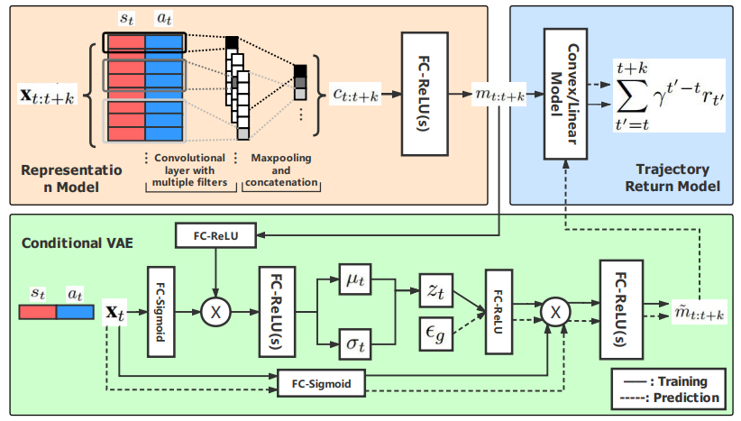

# AAAI2021-Value Decomposition with Latent Future Prediction (VDFP)

This is the official implementation of our work
[Foresee then Evaluate: Decomposing Value Estimation with Latent Future Prediction](https://ojs.aaai.org/index.php/AAAI/article/view/17182) accepted on AAAI 2021.


## Introduction  

The key idea of this work is inspired by the concept, called _Prospective Brain_ in neuroscience and congnative science.
That is, we deem that an RL agent should learn as human beings: 1) first imagine how the behavior (i.e., action) would influence the ongoing future, 2) then evaluate the imagined outcome in the future.

To fullfill a model-free agent which acts in a two-step way mentioned above, we proposed **Value Decomposition with Latent Future Prediction (VDFP)**, as illustrated below.
We analytically decompose the value function into a latent future dynamics part and a policy-independent trajectory return part, inducing a way to model latent dynamics and returns separately in value estimation. Further, we derive a practical deep RL algorithm, consisting of:
- a convolutional model to learn compact trajectory representation from past experiences,
- a conditional variational auto-encoder to predict the latent future dynamics,
- and a convex return model that evaluates trajectory representation.

<div align=center></div>

This may remind someone of model-based imagination, yet we deem that human beings usually act according to _intuition_ (vague but informative) which differs with explicit planning (although this is also a means to control).
Our work is also closely related to _Successor Feature_ or _Successor Representation_ literature.


## Repo Content
The source code mainly contains:  
-  implementation of our algorithm (VDFP) and other benchmark algorithms used in our experiments;  
-  the raw learning curves data and plot code.  

All the implementation and experimental details mentioned in our paper and the Supplementary Material can be found in our codes.  
  
  
## Installation

Here is an ancient installation guidance which needs step-by-step installation. A more automatic guidance with pip will be considered in the future.


Our codes are implemented with **Python 3.6** and **Tensorflow 1.8**. We recommend the user to install **anaconada** and or **venv** for convenient management of different python envs.

### Environment Setup
We conduct our experiments on [MuJoCo](https://roboti.us/license.html) continuous control tasks in [OpenAI gym](http://gym.openai.com). 
(Now MuJoCo is opensource due to the proposal of DeepMind.)
Please follow the guidance of installation MuJoCo and OpenAI gym as convention.

### Equipment
We run our experiments on both **Windows 7** and **Ubuntu 16.04 LTS** operating systems.  

### Dependency
Main dependencies and versions are listed below:  

| Dependency | Version |
| ------ | ------ |
| gym | 0.9.1 |
| mujoco-py | 0.5.7 | 
| mjpro | mjpro131 | 
| tensorflow | 1.8.0 | 
| tensorboard | 1.8.0 |
| scipy | 1.2.1 | 
| scikit-learn | 0.20.3 | 
| matplotlib | 3.0.3 | 

  
## Examples  
  
Examples of run commands can be seen in the file below:
> ./run/run_vdfp.sh

For hyperparameter settings, please refer to our paper for details. Feel free to modify on needs.


## Citation
If this repository has helped your research, please cite the following:
```
@inproceedings{Tang2021VDFP,
  author    = {Hongyao Tang and
               Zhaopeng Meng and
               Guangyong Chen and
               Pengfei Chen and
               Chen Chen and
               Yaodong Yang and
               Luo Zhang and
               Wulong Liu and
               Jianye Hao},
  title     = {Foresee then Evaluate: Decomposing Value Estimation with Latent Future
               Prediction},
  booktitle = {Thirty-Fifth {AAAI} Conference on Artificial Intelligence, {AAAI}
               2021, Thirty-Third Conference on Innovative Applications of Artificial
               Intelligence, {IAAI} 2021, The Eleventh Symposium on Educational Advances
               in Artificial Intelligence, {EAAI} 2021, Virtual Event, February 2-9,
               2021},
  pages     = {9834--9842},
  publisher = {{AAAI} Press},
  year      = {2021},
  url       = {https://ojs.aaai.org/index.php/AAAI/article/view/17182},
  timestamp = {Fri, 19 Nov 2021 10:30:41 +0100},
  biburl    = {https://dblp.org/rec/conf/aaai/TangMCCCYZLH21.bib},
  bibsource = {dblp computer science bibliography, https://dblp.org}
}
```
