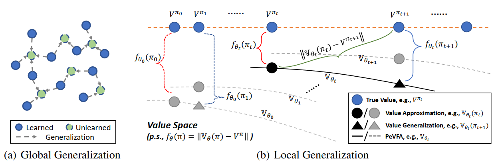

# RL with Policy Representation

Policy Representation is one major category in our taxonomy. 
The core research content of policy representation is to discover or learn **low-dimensional representation for RL policy**, which are beneficial to downstream RL tasks (e.g., policy learning).
In a general view, any decision-making problems which involves multiple policies or a policy optimization process, can be the potential downstream tasks of policy representation.

In our opinion, RL with Policy Representation contains the research on:
- **What an optimal policy representation should be like.**
- **How to obtain or learn desired policy representation in specific cases.**
- **How to make use of policy representation to develop and improve RL in different ways.**

## Repo Content

This repo contains representative research works of TJU-RL-Lab on the topic of RL with Policy Representation.
Currently, we focus on how policy representation can improve policy learning process in a general way.

### Two Types of Generalization

One major characteristic brought by policy representation is **value (more broadly, function) generalization among policies**.

Two general types of generalization is shown below:
- **Global Generalization**: denotes the general cases where values (or other policy-dependent functions) already learned (or known) for some policies can generalize to the values of other policies (i.e., unknown or unseen ones).
- **Local Generalization**: denotes the specific cases where values (or other policy-dependent functions) already learned (or known) for historical (or previous) policies encountered along the **policy improvement path** to the values of the following (or successive) policies we are going to estimate later.

### GPI with PeVFA

An obvious consequence of local generalization is that, we now have additional value generalization for the successive policies during typical Generalized Policy Iteration (GPI).
Taking advantage of this characteristic, we propose a new learning paradigm called **Generalized Policy Iteration with Policy-extended Value Function Approximator (GPI with PeVFA)**.

A comparison between conventional GPI and GPI with PeVFA is illsutrated below:

GPI with PeVFA is general and can be fulfilled by various means in principle. The key points we may have to conisder is:
- Whether the additional generalization is beneficial to or improves conventional RL.
- How to properly represent policies and establish PeVFA to release the best potentials. 

## An Overall View of Research Works in This Repo  

This repo will be constantly updated to include new researches made by TJU-RL-Lab. 
(The development of this repo is in progress at present.)

| Method | Is Contained | Is ReadME Prepared | Author | Publication | Link |
| ------ | --- | --- | ------ | ------ | ------ |
| PPO-PeVFA | ✅ | ✅ | Hongyao Tang  | AAAI 2022 | https://arxiv.org/abs/2010.09536 |

## Installation

The algorithms in this repo are all implemented **python 3.5** (and versions above). **Tensorflow 1.x** and **PyTorch** are the main DL code frameworks we adopt in this repo with different choices in different algorithms.

Note that the algorithms contained in this repo may not use all the same environments. Please check the README of specific algorithms for detailed installation guidance.

## TODO
- [ ] Add README file for PPO-PeVFA

## Related Work

Here we provide a useful list of representative related works on policy representation and policy-extended value functions.

### Policy-extended Value Function:
- Hongyao Tang, Zhaopeng Meng, Jianye Hao, Chen Chen, Daniel Graves, Dong Li, Hangyu Mao, Wulong Liu, Yaodong Yang, Changmin Yu. What About Inputing Policy in Value Function: Policy Representation and Policy-extended Value Function Approximator. AAAI 2021.
- Jean Harb, Tom Schaul, Doina Precup, Pierre-Luc Bacon. Policy Evaluation Networks. arXiv:2002.11833
- Francesco Faccio, Jürgen Schmidhuber. Parameter-based Value Functions. ICLR 2021
- Roberta Raileanu, Max Goldstein, Arthur Szlam, Rob Fergus. Fast Adaptation to New Environments via Policy-Dynamics Value Functions. ICML 2020

### Policy Representation:
- Aditya Grover, Maruan Al-Shedivat, Jayesh K. Gupta, Yuri Burda, Harrison Edwards. Learning Policy Representations in Multiagent Systems. ICML 2018
- Roberta Raileanu, Max Goldstein, Arthur Szlam, Rob Fergus. Fast Adaptation via Policy-Dynamics Value Functions. ICML 2020
- Nemanja Rakicevic, Antoine Cully, Petar Kormushev. Policy manifold search: exploring the manifold hypothesis for diversity-based neuroevolution. GECCO 2021
- Rundong Wang, Runsheng Yu, Bo An, Zinovi Rabinovich. I²HRL: Interactive Influence-based Hierarchical Reinforcement Learning. IJCAI 2020
- Oscar Chang, Robert Kwiatkowski, Siyuan Chen, Hod Lipson. Agent Embeddings: A Latent Representation for Pole-Balancing Networks. AAMAS 2019
- Isac Arnekvist, Danica Kragic, Johannes A. Stork. VPE: Variational Policy Embedding for Transfer Reinforcement Learning. ICRA 2019
- Thomas Unterthiner, Daniel Keysers, Sylvain Gelly, Olivier Bousquet, Ilya O. Tolstikhin. Predicting Neural Network Accuracy from Weights. arXiv:2002.11448

